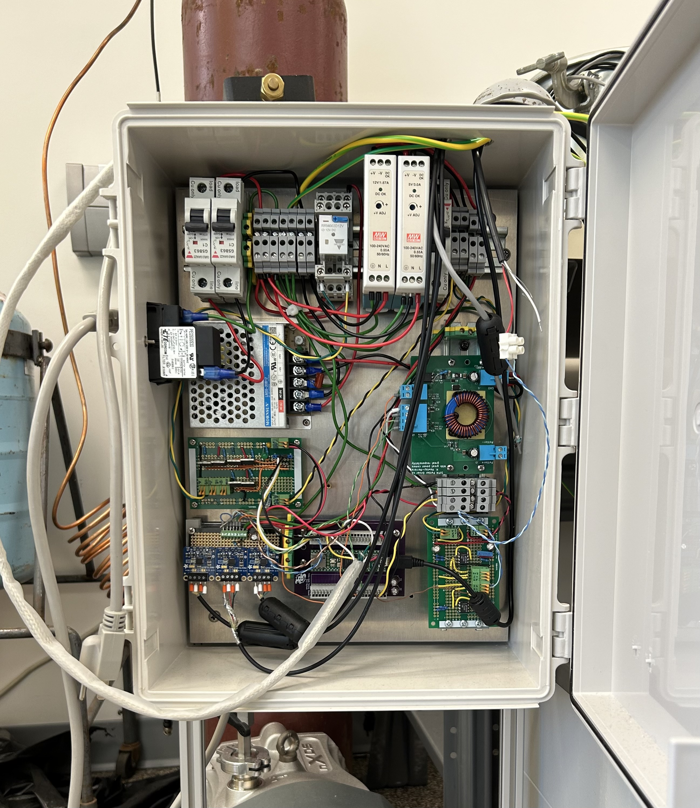

# Teensy controller board

Part of the requirements for the SiPM characterization was the acquisition of several transducers (3 PT-100 using modified [Adafruit MAX31865](https://www.adafruit.com/product/3328), one current output [pressure sensor](https://www.mcmaster.com/products/pressure-transducers/pressure-transmitters-6/) with custom-made electronics, and an [Adafruit BME280](https://www.adafruit.com/product/2652)) and the control of a cutstom-made Peltier current driver (which is also my work: [here!](https://github.com/hhawley/SiPM-Peltier-Driver)) using a personalized PID algorithm which is found in this code.

The particular strict timing requirements for the data acquisition and optimal usage of the PID system was the reason a real-time operating system (RTOS) had to be used.

A lot of work went into removing race conditions, priority inversion, and create a blazing fast efficient code!

I will include a diagram demonstrating how the code works in the future.

The version of FreeRTOS used for this the teensy is [freertos-teensy-10.4.1](https://github.com/tsandmann/freertos-teensy)

This code was written with the intention to be used with [PlatformIO](https://platformio.org/).

